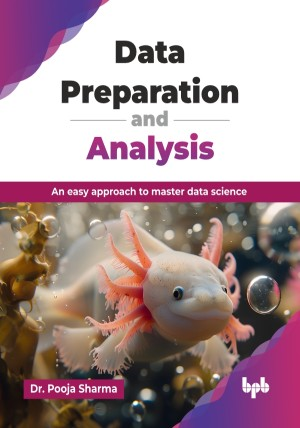

# Data Preparation and Analysis

An easy approach to master data science.

This is the repository for [Data Preparation and Analysis
](https://bpbonline.com/products/mastering-digital-product-management?variant=44731260862664),published by BPB Publications.

## About the Book
Data science is an evolving field, and the ability to effectively prepare and analyze data is a critical skill for any aspiring professional. This book serves as a comprehensive introduction to the foundational concepts and tools of data science, making it ideal for beginners and aspiring data professionals.

This book provides a structured and comprehensive learning path, beginning with a broad introduction to data science, its applications, and fundamental analysis methods. You will then explore the core Python libraries for data manipulation, NumPy for efficient numerical operations, and Pandas for powerful data structuring and transformation. The book dedicates significant focus to real-world data challenges, walking you through the crucial steps of data gathering, preparation, and cleaning; addressing issues like scalability, missing data, and inconsistencies. 

The book concludes with three real-world projects that apply the concepts in practical settings, making you proficient in the entire end-to-end data preparation and analysis pipeline. You will have a solid command of essential tools and techniques, empowering you to confidently tackle and derive meaningful insights from diverse datasets in any professional setting.

## What You Will Learn
• Implement ML models using NumPy, Pandas, Matplotlib, or scikit-learn.

• Gain a solid foundation in data science, principles, algorithms, and methodologies.

• Learn to frame real-world problems as ML tasks. 

• Implement data cleaning for consistency and missing data.

• Conduct exploratory data analysis with descriptive statistics.

• Uncover data patterns using clustering and association techniques.

• Design and create effective time series visualizations.

• Build interactive visualizations to explore data.

• Apply an end-to-end data workflow in practical projects.
